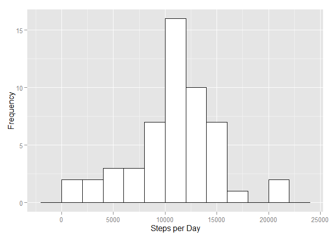
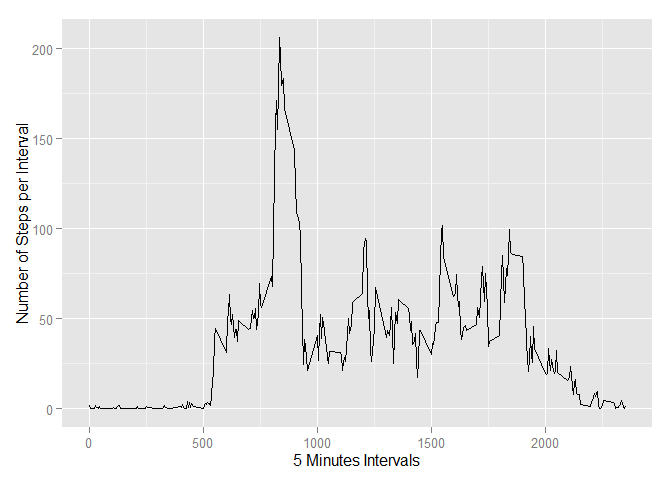
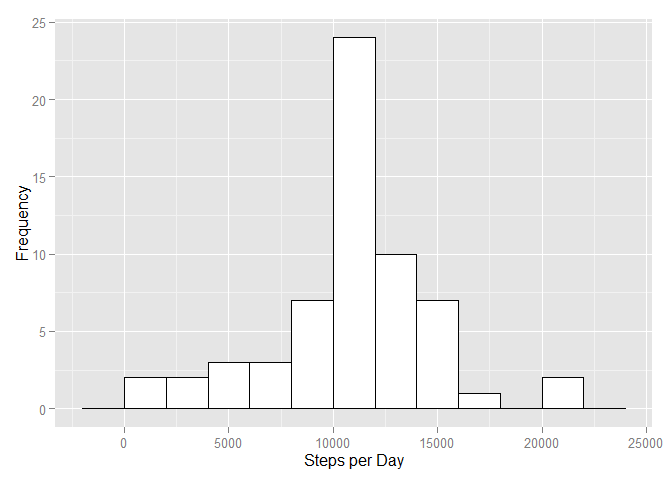
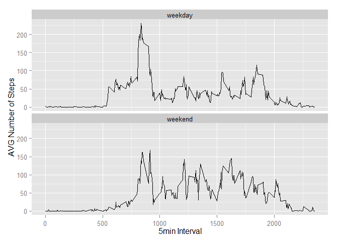

# Reproducible Research: Peer Assessment 1

```r
options(width = 100)
library(knitr)
rm(list=ls())
```

## Loading and preprocessing the data


```r
library(lubridate)
library(sqldf)
```

```
## Loading required package: gsubfn
## Loading required package: proto
## Loading required package: RSQLite
## Loading required package: DBI
```

```r
library(ggplot2)

#Load data
dataframe <- read.csv("./activity.csv", stringsAsFactors=FALSE)

#preprocess data
dataframe$date <- as.POSIXct(dataframe$date, format="%Y-%m-%d")

stepsperday = sqldf('SELECT date, SUM(steps) AS Steps 
                    FROM dataframe 
                    WHERE steps IS NOT NULL 
                    GROUP BY date')
```

```
## Loading required package: tcltk
```

```r
#print histogram
ggplot(stepsperday, aes(x=Steps)) + 
        geom_histogram(binwidth=2000, colour="black", fill="white") +
        labs(x="Steps per Day", y="Frequency")
```

 

## What is mean total number of steps taken per day?


```r
#mean
mean(stepsperday$Steps)
```

```
## [1] 10766
```

```r
#median
median(stepsperday$Steps)
```

```
## [1] 10765
```

## What is the average daily activity pattern?


```r
stepsperinterval = sqldf('SELECT interval AS Interval, SUM(steps) StepSUM, avg(steps) StepAVG 
                         FROM dataframe 
                         WHERE steps is not null 
                         GROUP BY interval')

ggplot(stepsperinterval, aes(Interval, StepAVG)) + 
        geom_line() +
        labs(x="5 Minutes Intervals", y="Number of Steps per Interval")
```

 

```r
#row number with the maximum value
which.max(stepsperinterval$StepAVG)
```

```
## [1] 104
```

```r
#Interval with the maximum value
stepsperinterval$Interval[which.max(stepsperinterval$StepAVG)]
```

```
## [1] 835
```

```r
#number of steps in the interval with the maximum value
max(stepsperinterval$StepAVG)
```

```
## [1] 206.2
```

## Imputing missing values


```r
#total number of missing values in the dataset
sqldf('SELECT COUNT(*) FROM dataframe WHERE steps IS NULL')
```

```
##   COUNT(*)
## 1     2304
```

```r
#replace missing values by stepsperinterval$Steps
newframe <- 
      sqldf('
            SELECT  dataframe.steps, 
                    dataframe.date, 
                    dataframe.interval, 
                    stepsperinterval.StepAVG AS IntervalMean
            FROM dataframe 
            JOIN stepsperinterval 
            ON dataframe.interval = stepsperinterval.Interval
            ')
newframe$steps[is.na(dataframe$steps)] <- newframe$IntervalMean[is.na(dataframe$steps)]


stepsperdaynew = sqldf('SELECT date, SUM(steps) Steps FROM newframe WHERE steps 
                    is not null GROUP BY date')

ggplot(stepsperdaynew, aes(x=Steps)) + 
        geom_histogram(binwidth=2000, colour="black", fill="white") +
        labs(x="Steps per Day", y="Frequency")
```

 

```r
#mean
mean(stepsperdaynew$Steps)
```

```
## [1] 10766
```

```r
#median
median(stepsperdaynew$Steps)
```

```
## [1] 10766
```

```r
compare_impute = sqldf('SELECT stepsperdaynew.*, stepsperday.* FROM stepsperdaynew LEFT JOIN stepsperday ON stepsperday.Date = stepsperdaynew.Date ORDER BY stepsperdaynew.Date')
```
###The median changes only from 10765 to 10766. The mean does not change since all the missing values are whole days that are missing (see compare_impute). Hence they all get the same impute value which equals the mean with my impute strategy. Only the bar containing the mean-value increases, all the other bars in the histogram don't change.


## Are there differences in activity patterns between weekdays and weekends?


```r
library(grid)
library(gridExtra)

#add a column with the according weekday number (lubridate function)
newframe$wd <- wday(newframe$date)
newframe$weekday <- "weekday"
newframe$weekday[which(wday(newframe$date) == 1)] <- "weekend"
newframe$weekday[which(wday(newframe$date) == 7)] <- "weekend"
newframe$weekday <- as.factor(newframe$weekday)

weekdayframe <- 
      sqldf('
            SELECT interval, AVG(steps) as AVGsteps, weekday
            FROM newframe
            GROUP BY interval, weekday
            ORDER BY interval
            ')

p1<- ggplot() + geom_line(data=weekdayframe, aes(interval, AVGsteps)) + 
        labs(x="5min Interval", y="AVG Number of Steps") +
        facet_wrap(~weekday, nrow=2)
gp1<- ggplot_gtable(ggplot_build(p1))
grid.arrange(gp1)
```

 

```r
#
```
###During the weekdays, the average steps increase earlier in the morning than on the weekend days. This might be an indicator for sleeping in on the weekend.
###The peak in the morning is lower on the weekend.
###The average steps during the rest of the day are higher on the weekend.
###There are more steps around 2000 on the weekend than during the week.
